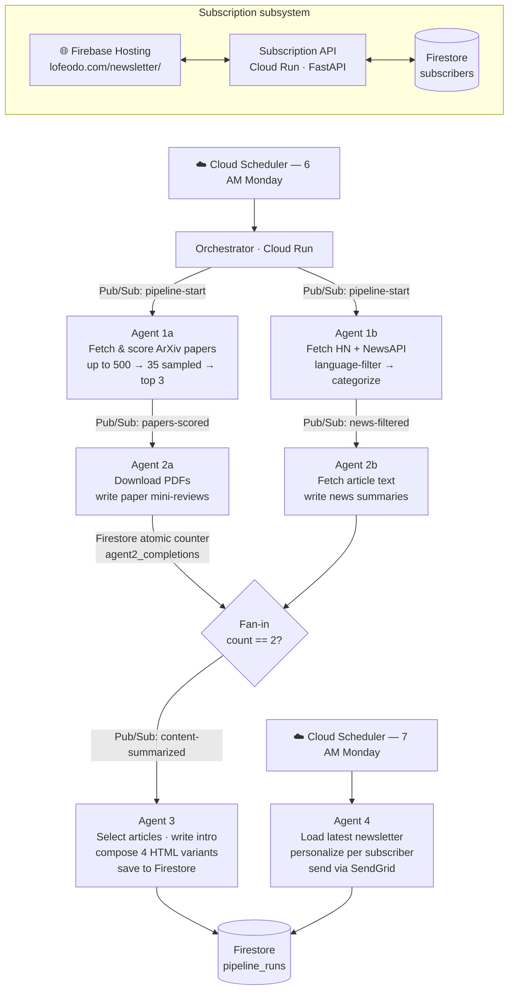

# Latent SpaceMail

A weekly agentic pipeline that automatically curates and delivers a morning AI briefing, combining selected AI-research papers from ArXiv with the top AI-industry news from live sources, as a personalized HTML email newsletter. Built on Google Cloud Platform with six specialized agents orchestrated via Pub/Sub and Firestore.

---

## Pipeline



---

## How it works

### Stage by stage

**Agent 1a — Fetch & score papers**
Queries ArXiv for `cs.AI + cs.LG` papers from the last 7 days (up to 500), randomly samples 35, downloads each PDF, and scores it via Claude forced tool use against a 7-dimension, 28-point rubric (`prompts/scoring_rubric.txt`). Top 3 by score advance. PDF fetches route through a Squid proxy (set via `HTTPS_PROXY`) because GCP IPs are throttled by ArXiv. Up to 5 concurrent Claude calls, exponential backoff on 429s (10s / 20s / 40s).

**Agent 1b — Fetch & filter news**
Pulls top stories from the Hacker News API and runs 10 NewsAPI queries (English global, French global, Canada/Montreal). Pre-filters paywalled domains and non-Latin titles in code, then uses Claude to language-filter (English/French only) and categorize into 7 categories. Up to 5 concurrent Claude calls in 200-article batches.

**Agent 2a — Summarize papers**
Downloads PDFs again (falls back to abstract + scoring notes if unavailable), calls Claude to write a 2-paragraph mini-review per paper. Up to 5 concurrent calls.

**Agent 2b — Summarize news**
Fetches full article text with `newspaper3k` (GitHub repos via the GitHub API, Twitter/X URLs skipped). Calls Claude for a 2-3 sentence summary per article. Up to 3 concurrent Claude calls, 20 concurrent fetch workers.

**Fan-in**
Both agent 2a and 2b atomically increment `agent2_completions` in the Firestore run document using a Firestore transaction. The one that pushes the counter to 2 publishes `content-summarized` to trigger agent 3.

**Agent 3 — Compose**
Runs two article-selection passes per category (all languages, English-only) to support subscriber preference variants. Calls Claude to pick the best 3-5 articles per category (HN ≥ 100 = always included, named model releases always included). Writes a 2-3 sentence editor's note. Renders 4 HTML variants keyed by `{include_french}_{include_canada}`. Saves all variants to Firestore and copies `0_0` to `public/newsletter/latest.html` for the live preview.

**Agent 4 — Send**
Triggered separately by Cloud Scheduler at 7 AM. Loads the most recent run's newsletter variants from Firestore, queries active subscribers, picks each subscriber's variant by preference key, substitutes `{{UNSUBSCRIBE_URL}}` and `{{PREFERENCES_URL}}` placeholders with per-subscriber token links, and sends via SendGrid. Logs a structured JSON send summary to stdout for Cloud Logging.

### Subscription system

A separate FastAPI service handles sign-ups and preferences. Two auth paths coexist:

**Token-based (email links):** The original "inbox is the authentication" model. Website-initiated actions trigger an email round-trip; token-carrying links clicked inside an email prove inbox ownership. Tokens are `secrets.token_urlsafe(32)`, 48h TTL for confirmation, 1-year TTL for action links. Still used for newsletter footer links (unsubscribe, preferences) for all subscribers.

**Account-based (Firebase Auth):** Users sign up or sign in via `login.html` using Google OAuth or email + password. The frontend gets a Firebase ID token and sends it as `Authorization: Bearer <token>`. The backend (`agents/auth_middleware.py`) verifies it with `firebase-admin`. No confirmation email needed — Firebase handles email verification. Account-based subscribers can manage preferences and unsubscribe directly without waiting for an email link.

Subscriber document fields: `email`, `token`, `token_expires_at`, `active`, `subscribed_at`, `confirmed_at`, `prefs: {include_french, include_canada}`, `send_latest`, `latest_sent`, `uid` (Firebase UID, null for legacy token-only subscribers). Unsubscribe sets `active: false` (soft delete, never hard-deleted).

---

## Tech stack

- **Language:** Python 3.11
- **Compute:** Google Cloud Run (single Docker image, `AGENT_NAME` env var selects agent)
- **Messaging:** Google Cloud Pub/Sub (push subscriptions, JSON `{run_id}` payload)
- **State:** Google Cloud Firestore (`pipeline_runs`, `subscribers`, `users` collections)
- **Scheduling:** Google Cloud Scheduler (two weekly cron jobs)
- **Secrets:** Google Secret Manager
- **Auth:** Firebase Authentication (Google OAuth + email/password; ID tokens verified server-side with `firebase-admin`)
- **Frontend:** Firebase Hosting (static, custom domain via Cloudflare DNS; vanilla HTML/JS + Firebase Auth JS SDK)
- **Email:** SendGrid (custom domain `newsletter@lofeodo.com`, DKIM + SPF + DMARC)
- **AI:** Anthropic Claude (`claude-haiku-4-5-20251001`) — scoring, filtering, summarization, composition
- **External APIs:** ArXiv (via DigitalOcean Squid proxy), Hacker News API, NewsAPI, GitHub API
- **HTTP framework:** FastAPI + uvicorn
- **Key libraries:** `arxiv`, `pypdf`, `newspaper3k`, `slowapi`, `firebase-admin`

---

## Repository structure

```
.
├── agents/
│   ├── agent1a_fetch_papers.py     # ArXiv fetch + Claude scoring
│   ├── agent1b_fetch_news.py       # HN + NewsAPI fetch, language filter, categorize
│   ├── agent2a_summarize_papers.py # PDF download + Claude paper reviews
│   ├── agent2b_summarize_news.py   # Article fetch + Claude news summaries
│   ├── agent3_compose.py           # Article selection, intro, HTML composition
│   ├── agent4_send.py              # Per-subscriber personalization + SendGrid send
│   ├── agent_subscriptions.py      # Subscription FastAPI service (separate deployment)
│   ├── auth_middleware.py          # Firebase ID token verification (FastAPI dependency)
│   ├── filter_tool.py              # Claude tool schema for news categorization
│   └── scoring_tool.py             # Claude tool schema for paper scoring
├── prompts/
│   ├── scoring_rubric.txt          # 7-dimension paper scoring prompt
│   ├── paper_summary_prompt.txt    # Paper mini-review prompt
│   ├── news_filter_prompt.txt      # News categorization prompt
│   ├── news_summary_prompt.txt     # News article summary prompt
│   ├── news_summary_fallback_prompt.txt
│   ├── article_selection_prompt.txt
│   └── intro_prompt.txt            # Editor's note prompt
├── public/newsletter/              # Firebase Hosting frontend
│   ├── index.html                  # Subscribe form (auth-aware nav)
│   ├── login.html                  # Sign in / create account (Google + email+password)
│   ├── preferences.html            # Preferences (account auth or token fallback)
│   ├── unsubscribe.html            # Unsubscribe (one-click if signed in, email form otherwise)
│   ├── preview.html                # Newsletter preview page
│   ├── auth.js                     # Shared Firebase Auth helper (ES module)
│   └── latest.html                 # Written by agent3 each run
├── orchestrator.py                 # Local sequential runner / cloud pipeline trigger
├── main.py                         # Cloud Run entrypoint (FastAPI, AGENT_NAME dispatch)
├── config.py                       # Shared constants and env var reads
├── Dockerfile                      # Single image, AGENT_NAME build arg
├── firebase.json                   # Firebase Hosting config
└── requirements.txt
```

---

## Configuration

Secrets live in **Google Secret Manager** (cloud) or environment variables (local). No secrets are committed to this repo.

| Variable | Used by | Purpose |
|---|---|---|
| `ANTHROPIC_1ST_API_KEY` | agent1a, agent2a, agent2b, agent3 | Claude API key |
| `NEWS_API_KEY` | agent1b | NewsAPI key |
| `SENDGRID_API_KEY` | agent4, agent_subscriptions | SendGrid key (local mode; cloud uses Secret Manager) |
| `USE_SECRET_MANAGER` | agent4, agent_subscriptions | Load SendGrid key from Secret Manager instead of env |
| `USE_FIRESTORE` | all agents | Enable cloud mode (Pub/Sub + Firestore); default `false` |
| `GCP_PROJECT_ID` | all agents | Google Cloud project ID |
| `HTTPS_PROXY` / `HTTP_PROXY` | agent1a | Squid proxy URL for ArXiv (GCP IPs are throttled) |
| `AGENT_NAME` | main.py | Selects which agent the Cloud Run container runs |
| `TEST_RECIPIENT_EMAIL` | agent4 | Local mode: single send address |
| `TEST_SEND_TO` | agent4 | Cloud mode override: skip subscriber list, send only here |
| `SERVICE_BASE_URL` | agent4, agent_subscriptions | Public URL of the subscription API service |
| `FRONTEND_BASE_URL` | agent3, agent4, agent_subscriptions | Public URL of the Firebase Hosting frontend |
| `ALLOWED_ORIGINS` | main.py (subscriptions) | Comma-separated CORS origins; required in production |
| `MAILING_ADDRESS` | agent3 | Physical address in email footer (CASL compliance) |
| `ADMIN_TOKEN` | agent_subscriptions | Token to access `/stats` endpoint |
| `MAX_SUBSCRIBERS` | agent_subscriptions | Subscriber cap (default `100`, SendGrid free tier) |
| `GOOGLE_APPLICATION_CREDENTIALS` | agent_subscriptions (local) | Path to service account JSON for Firebase Admin SDK; alternative to `gcloud auth application-default login` |

---

## Local development

**Run the full pipeline (no cloud infra required):**
```bash
export ANTHROPIC_1ST_API_KEY=sk-...
export NEWS_API_KEY=...
python orchestrator.py
# Outputs to data/ directory
```

**Run a single agent:**
```bash
python agents/agent1a_fetch_papers.py
python agents/agent2a_summarize_papers.py
# etc.
```

**Run the FastAPI server (Cloud Run entrypoint):**
```bash
AGENT_NAME=agent1a uvicorn main:app --reload
```

**Run the subscription service locally:**
```bash
AGENT_NAME=agent_subscriptions uvicorn main:app --reload
# Requires: gcloud auth application-default login (Firestore always on)
```

**Run the frontend locally with auth support:**
```bash
firebase serve --only hosting
# Serves public/newsletter/ at localhost:5000 and provides /__/firebase/init.json
# Plain HTTP servers (python -m http.server, etc.) won't serve that endpoint,
# so auth.js will fail to initialize on pages that use Firebase Auth.
```

## Deployment

**Build and push to Artifact Registry:**
```bash
docker build --build-arg AGENT_NAME=agent1a -t REGION-docker.pkg.dev/PROJECT/REPO/agent1a .
docker push REGION-docker.pkg.dev/PROJECT/REPO/agent1a
```

**Deploy to Cloud Run:**
```bash
gcloud run deploy agent1a \
  --image REGION-docker.pkg.dev/PROJECT/REPO/agent1a \
  --region REGION \
  --no-cpu-throttling \     # required for pipeline agents (background thread)
  --set-env-vars AGENT_NAME=agent1a,USE_FIRESTORE=true,...
```

The subscription service and agent4 (sender) are synchronous and don't need `--no-cpu-throttling`.

---

## Design decisions

**Event-driven fan-in.** Agents 2a and 2b run in parallel (both triggered by their respective Pub/Sub messages). A Firestore atomic transaction increments `agent2_completions`; the agent that pushes the count to 2 publishes `content-summarized`. This avoids a coordinator process and handles the race condition correctly under concurrent Cloud Run instances.

**ArXiv proxy.** GCP datacenter IPs are rate-limited or blocked by ArXiv's CDN. A DigitalOcean-hosted Squid proxy is set via `HTTPS_PROXY`; both the `urllib` opener and the `arxiv` library's internal `requests.Session` are patched to use it.

**No CPU throttling on pipeline agents.** Cloud Run's default "CPU only allocated during request" would pause the background thread immediately after the HTTP response is returned. Pipeline agents use `--no-cpu-throttling` so the thread runs to completion. Synchronous services (agent4, subscriptions) don't need this.

**Dual auth model.** The subscription service supports two auth paths. The original "inbox as auth" token model (email links) remains fully functional for newsletter footer links and legacy subscribers. A new account-based path uses Firebase Authentication (Google OAuth + email/password): the frontend gets a Firebase ID token and sends it as `Authorization: Bearer`; `auth_middleware.py` verifies it with `firebase-admin`. Account-based subscribers get immediate subscribe/unsubscribe/preferences without waiting for an email — the Firebase auth flow already verified inbox ownership. Both paths read and write the same `subscribers` Firestore collection; account subscribers get a `uid` field linking them to the `users` collection.

**Email deliverability.** Mail sends from `newsletter@lofeodo.com` via SendGrid with full domain authentication (DKIM + SPF via CNAME records, DMARC policy). Sending from a gmail.com address through a third-party relay fails SPF alignment and lands in spam — a controlled sending domain is required.

**Soft delete.** Unsubscribing sets `active: false`; the document is never deleted. This preserves the audit trail and allows re-subscription without losing history.

**Subscriber variants.** Agent 3 generates four newsletter HTML variants keyed by `{include_french}_{include_canada}` (`0_0`, `1_0`, `0_1`, `1_1`). Agent 4 picks the correct variant per subscriber at send time, so no re-rendering is needed per send.
