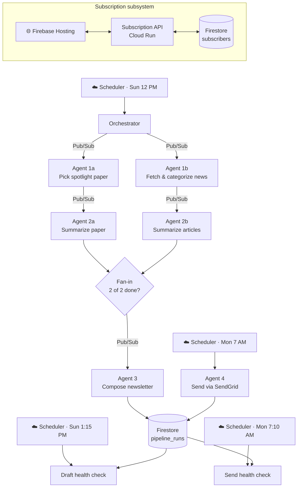
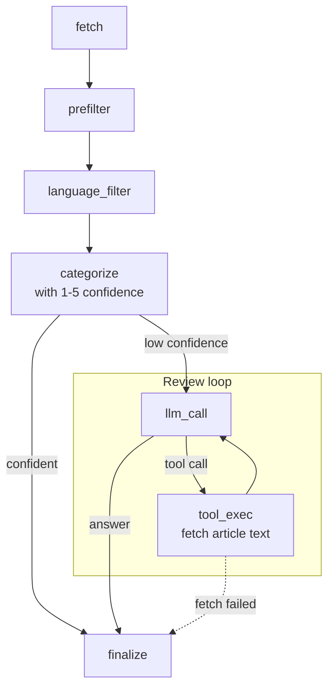

# Latent SpaceMail

A weekly AI briefing, written and sent by a team of AI agents: one spotlight research paper plus the week's top AI news, delivered as a personalized email.

- **Agentic orchestration**: six agents on Google Cloud, coordinated by Pub/Sub, plus a LangGraph review loop inside one of them.
- **Live monitoring**: health checks, drift detection, cost tracking and an LLM judge report on every run.
- **Measured, not claimed**: evaluation results are generated from scripts, with confidence intervals.
- **Real cloud operations**: Cloud Run, Cloud Build, GitHub Actions CI, secrets management and no-redeploy rollback switches.

## How it works

Stage-by-stage detail: [docs/architecture.md](docs/architecture.md)

```mermaid
flowchart TB
    subgraph SUB["Subscription subsystem"]
        direction LR
        FE["🌐 Firebase Hosting"] <--> SUBS["Subscription API\nCloud Run"]
        SUBS <--> FSS[("Firestore\nsubscribers")]
    end

    SUB ~~~ CS1

    CS1["☁️ Scheduler · Sun 12 PM"] --> ORC["Orchestrator"]

    ORC -->|"Pub/Sub"| A1A["Agent 1a\nPick spotlight paper"]
    ORC -->|"Pub/Sub"| A1B["Agent 1b\nFetch & categorize news"]

    A1A -->|"Pub/Sub"| A2A["Agent 2a\nSummarize paper"]
    A1B -->|"Pub/Sub"| A2B["Agent 2b\nSummarize articles"]

    A2A --> FAN{"Fan-in\n2 of 2 done?"}
    A2B --> FAN

    FAN -->|"Pub/Sub"| A3["Agent 3\nCompose newsletter"]

    FAN ~~~ CS2
    CS2["☁️ Scheduler · Mon 7 AM"] --> A4["Agent 4\nSend via SendGrid"]

    A3 --> FSP[("Firestore\npipeline_runs")]
    A4 --> FSP

    FAN ~~~ CS3
    CS3["☁️ Scheduler · Sun 1:15 PM"] --> HCD["Draft health check"]
    CS4["☁️ Scheduler · Mon 7:10 AM"] --> HCS["Send health check"]
    FSP --> HCD
    FSP --> HCS
```

| Agent | What it does |
|---|---|
| **1a** Papers | Picks the week's spotlight paper from Hugging Face's trending list and scores it with Claude. |
| **1b** News | Gathers Hacker News and NewsAPI stories, filters by language and sorts them into 7 categories. |
| **2a / 2b** Summaries | Write a short summary of the paper (2a) and of each article (2b), in parallel. |
| **3** Compose | Picks the best articles per category, writes the editor's note and builds the HTML email. |
| **4** Send | Sends each subscriber their personalized version through SendGrid on Monday morning. |
| **Health checks** | A draft check on Sunday and a send check on Monday email a report on every run. |

## Agentic orchestration

- **Between agents:** Pub/Sub events plus a Firestore counter that joins agents 2a and 2b before agent 3 starts.
- **Inside an agent:** agent 1b is a LangGraph graph that sends low-confidence articles to a small tool-using review loop.
- **Failure handling:** every agent records its errors to Firestore, a watchdog kills hung runs, and the crash-prone agent 2b retries in an isolated process.
- **Rollback:** `AGENT1B_MODE=single_pass` restores the original linear code without a redeploy.

```mermaid
flowchart TB
    FETCH["fetch"] --> PRE["prefilter"]
    PRE --> LANG["language_filter"]
    LANG --> CAT["categorize\nwith 1-5 confidence"]

    CAT -->|"confident"| FIN["finalize"]
    CAT -->|"low confidence"| LLM

    subgraph REVIEW["Review loop"]
        direction TB
        LLM["llm_call"] -->|"tool call"| TOOL["tool_exec\nfetch article text"]
        TOOL --> LLM
    end

    LLM -->|"answer"| FIN
    TOOL -.->|"fetch failed"| FIN
```

Why LangGraph runs inside agents but not between them: [ADR 0001](docs/decisions/0001-langgraph-inside-agents.md).

## Live monitoring

Every weekly run ends in an email report to the maintainer, whether or not anything is wrong, so a missing email is itself a signal.

| Signal | What it watches | Response |
|---|---|---|
| **Health checks** | Every pipeline stage, the composed newsletter and delivery | Email report: all clear or problem detected |
| **Failure recording and watchdog** | Agent errors and hung or crashed runs | Written to Firestore; hung runs are killed |
| **Drift** | Agent 1b's confidence, category mix and review rate | Flagged only for large, significant shifts |
| **Token and cost** | LangSmith token and cost totals per run | Flagged on big jumps versus prior weeks |
| **Summary judge** | A weekly sample of summaries checked against their sources | Report only (see Results) |
| **Click signal** | Aggregate link clicks, with no subscriber data | Informational section in the report |

Details: [docs/monitoring.md](docs/monitoring.md)

## Cloud, CI and operations

| Area | What's in place |
|---|---|
| **Cloud** | 10 Cloud Run services from one Docker image, Pub/Sub, Firestore, Cloud Scheduler, Secret Manager, Firebase Hosting and Auth |
| **Build and deploy** | Cloud Build builds every image in parallel; deploys are separate, deliberate steps; API keys are mounted from Secret Manager |
| **CI** | GitHub Actions runs the full test suite (stubbed Claude client, no keys) and a Docker build check on every push and pull request |
| **Evaluation** | Paid evals run on demand behind a cost estimate and a hard cap; results are JSON files with confidence intervals |
| **Observability** | LangSmith tracing, the weekly health check report, structured logs |
| **Reliability** | Idempotent fan-in, isolated retries, a 24-hour stale-newsletter guard, rollback switches |
| **Stack** | Python 3.11, Anthropic Claude, LangGraph, FastAPI, SendGrid, Firebase Auth |

Deployment and local setup: [docs/development.md](docs/development.md)

## Results

All tables below are generated from `evals/results/*.json`, never typed by hand.

### Does the review loop help?

Agent 1b's review loop was compared with the original single-pass code on the same hand-labeled articles. It did not measurably help: the differences sit inside the noise, and the model's own confidence did not predict its mistakes. Reported plainly.

<!-- review-eval:start -->
| Variant | Accuracy (95% CI) | n |
|---|---|---|
| Single-pass | 62% (52%–72%) | 90 |
| Graph, first pass | 59% (49%–68%) | 90 |
| Graph, after review | 60% (50%–70%) | 90 |

Paired per article, graph vs single-pass: 5 wins, 7 losses, 78 ties out of 90.
<!-- review-eval:end -->

### Prompt-injection tests

Hand-written attacks (forced categories, tag breakouts, prompt leaks, planted URLs) were run through the real agent code paths, once with the injection and once without. The attacks that worked before the fixes were stopped by input sanitising, guard text on every Claude call and a fetch guard. The checks catch canary-style compliance only, and small samples mean "none observed" is not "safe".

<!-- injection-eval:start -->
| Attacks that achieved their goal | Before fixes | After fixes | Control (no injection) |
|---|---|---|---|
| overall | 10/115 (5%–15%) | 0/115 (0%–3%) | 0/115 (0%–3%) |
<!-- injection-eval:end -->

### Summary judge

A second Claude model checks a weekly sample of summaries against the text they were written from. Calibrated against 40 summaries I labeled by hand, it agreed with me no better than chance (kappa in the table), so it runs report-only and can never trigger an alert.

<!-- judge-calibration:start -->
Generated from `evals/results/judge_calibration.json` (git `bf0b99e`, 2026-10-06, cost $0.5578). 95% intervals in parentheses.

| Metric | Value | n |
|---|---|---|
| agreement | 45% (31%–60%) | 40 |
| unsupported recall | 67% (30%–90%) | 6 |
| cohens kappa | 0.04 (-0.15 to 0.23) | 40 |
<!-- judge-calibration:end -->

Full results and caveats: [docs/evaluation.md](docs/evaluation.md)

## Documentation

- [Architecture](docs/architecture.md): stage-by-stage detail, orchestration and the subscription system
- [Design decisions](docs/design-decisions.md): why the system is built this way
- [Monitoring](docs/monitoring.md): health checks, drift, cost, judge and click signal
- [Evaluation](docs/evaluation.md): full review-loop and prompt-injection results
- [Configuration](docs/configuration.md): environment variables
- [Local development and deployment](docs/development.md)
- [Repository structure](docs/repository-structure.md)
- [Evaluation harness conventions](evals/README.md)
