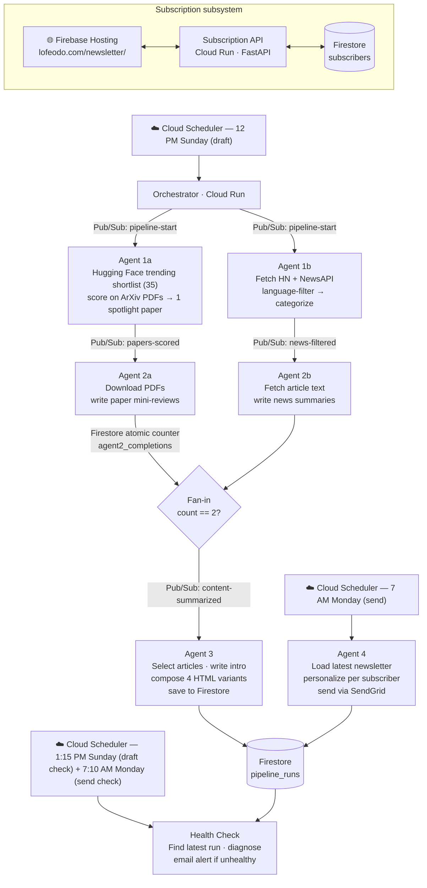
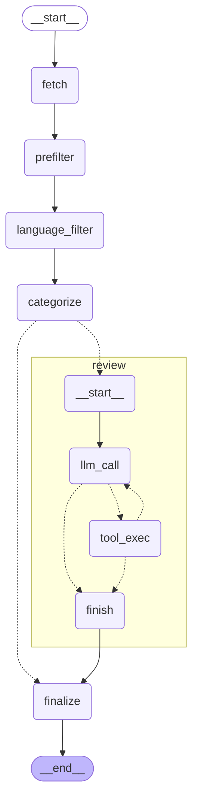

# Latent SpaceMail

**Live site: [newsletter.lofeodo.com](https://newsletter.lofeodo.com)**

A weekly agentic pipeline that automatically curates and delivers a morning AI briefing, combining a spotlight AI-research paper with the top AI-industry news from live sources, as a personalized HTML email newsletter. Built on Google Cloud Platform with six specialized agents orchestrated via Pub/Sub and Firestore, and backed by evaluation and monitoring (drift detection, token/cost tracking, an LLM summary judge, a click signal) and a prompt-injection test suite.

---

## Pipeline


```mermaid
flowchart TB
    subgraph SUB["Subscription subsystem"]
        direction LR
        FE["🌐 Firebase Hosting\nlofeodo.com/newsletter/"] <--> SUBS["Subscription API\nCloud Run · FastAPI"]
        SUBS <--> FSS[("Firestore\nsubscribers")]
    end

    SUB ~~~ CS1

    CS1["☁️ Cloud Scheduler — 12 PM Sunday (draft)"] --> ORC["Orchestrator · Cloud Run"]

    ORC -->|"Pub/Sub: pipeline-start"| A1A["Agent 1a\nHugging Face trending shortlist (35)\nscore on ArXiv PDFs → 1 spotlight paper"]
    ORC -->|"Pub/Sub: pipeline-start"| A1B["Agent 1b\nFetch HN + NewsAPI\nlanguage-filter → categorize"]

    A1A -->|"Pub/Sub: papers-scored"| A2A["Agent 2a\nDownload PDFs\nwrite paper mini-reviews"]
    A1B -->|"Pub/Sub: news-filtered"| A2B["Agent 2b\nFetch article text\nwrite news summaries"]

    A2A -->|"Firestore atomic counter\nagent2_completions"| FAN{"Fan-in\ncount == 2?"}
    A2B --> FAN

    FAN -->|"Pub/Sub: content-summarized"| A3["Agent 3\nSelect articles · write intro\ncompose 4 HTML variants\nsave to Firestore"]

    FAN ~~~ CS2
    CS2["☁️ Cloud Scheduler — 7 AM Monday (send)"] --> A4["Agent 4\nLoad latest newsletter\npersonalize per subscriber\nsend via SendGrid"]

    A3 --> FSP[("Firestore\npipeline_runs")]
    A4 --> FSP

    FAN ~~~ CS3
    CS3["☁️ Cloud Scheduler — 1:15 PM Sunday (draft check) + 7:10 AM Monday (send check)"] --> HC["Health Check\nFind latest run · diagnose\nemail alert if unhealthy"]
    FSP --> HC
```

---

## How it works

### Stage by stage

**Agent 1a — Fetch & score papers**
Picks the week's spotlight paper from a **trending shortlist**: the 35 most-upvoted Hugging Face Daily Papers of the last 14 days that are `cs.AI`/`cs.LG` and have not been spotlighted before (history kept in Firestore `spotlighted_papers`; deduplication happens before truncating to 35, so the pool refills from the next-ranked papers). Claude scores each paper through forced tool use on 8 dimensions (`prompts/scoring_rubric.txt`, max 33), including a `wow_factor` (would a non-specialist instantly get why it matters). Code adds a `community_traction` score (1–8, from the paper's Hugging Face upvote percentile within the shortlist), for a total out of 41; the total is recomputed in code rather than trusted from the model. The top paper advances and is recorded as spotlighted. If Hugging Face or the ArXiv lookup fails (or yields fewer than 10 papers) it falls back to a random sample of 35 from the last 7 days of ArXiv. PDF fetches route through a Squid proxy (set via `HTTPS_PROXY`) because GCP IPs are throttled by ArXiv. Up to 5 concurrent Claude calls, exponential backoff on 429s (10s / 20s / 40s).

**Agent 1b — Fetch & filter news**
Pulls the week's top 1000 Hacker News stories by points (Algolia search API, since the front-page ranking decays before Monday) and runs 10 NewsAPI queries (English global, French global, Canada/Montreal). Pre-filters paywalled domains and non-Latin titles in code, then uses Claude to language-filter (English/French only, 25-article batches) and categorize into 7 categories (100-article batches). Up to 5 concurrent Claude calls. Internally a LangGraph graph (see [Inside agent 1b](#inside-agent-1b-langgraph)): the categorizer also reports a 1–5 confidence, and low-confidence articles are re-checked by a small tool-calling review loop that can fetch the article text before deciding.

**Agent 2a — Summarize papers**
Downloads PDFs again (falls back to abstract + scoring notes if unavailable), calls Claude to write a short curiosity-hook summary (2–3 sentences) of the spotlight paper. Up to 5 concurrent calls. Like agent 2b, it saves the exact source text each summary was written from (Firestore `summary_sources`, expiring) so the online judge can check a summary against what the summarizer saw.

**Agent 2b — Summarize news**
Fetches full article text with `newspaper3k` (GitHub repos via the GitHub API, Twitter/X URLs skipped). Calls Claude for a 2-3 sentence summary per article. Up to 3 concurrent Claude calls, 20 concurrent fetch workers.

**Fan-in**
Both agent 2a and 2b atomically increment `agent2_completions` in the Firestore run document using a Firestore transaction. The one that pushes the counter to 2 publishes `content-summarized` to trigger agent 3.

**Agent 3 — Compose**
Runs two article-selection passes per category (all languages, English-only) to support subscriber preference variants. Calls Claude to pick the best articles per category: 3 by default, more only for major stories. Each article is labelled with its HN points and its rank among the section's HN stories (vote counts vary by topic, so there is no fixed threshold); articles without an HN score are not penalized, and are shown in a seeded-shuffle order so list position carries no signal. Writes a 2-3 sentence editor's note. Renders 4 HTML variants keyed by `{include_french}_{include_canada}`. The spotlight paper renders as a dark hero card directly under the editor's note, linking to its Hugging Face page, and a one-line share strip follows the first news section. Saves all variants to Firestore (shrinking the run document's large article pools first, to stay under Firestore's 1 MiB document cap) and copies `0_0` to `public/newsletter/latest.html` for the live preview.

**Agent 4 — Send**
Triggered separately by Cloud Scheduler at 7 AM Monday, a day after the pipeline drafted the newsletter (Sunday 12 PM; the issue is dated the send day). Loads the most recent run's newsletter variants from Firestore, queries active subscribers, picks each subscriber's variant by preference key, substitutes `{{UNSUBSCRIBE_URL}}` and `{{PREFERENCES_URL}}` placeholders with per-subscriber token links, and sends via SendGrid. Logs a structured JSON send summary to stdout for Cloud Logging, and also writes it to the run's Firestore document (`agent4_send_summary`, `agent4_completed_at`) so delivery success is queryable, not just visible in logs. With `CLICK_TRACKING=true` it also turns on SendGrid click tracking and tags each email with the run id (never a subscriber id); see [Click signal](#click-signal). Refuses to send (raises instead) if the newsletter it found is more than 24 hours old — a stalled pipeline upstream of agent 3 otherwise leaves the most recent *composed* run pointing at an older week's content, which agent 4 would ship silently with no error. The stalled-pipeline case it guards against is described under [Design decisions](#design-decisions).

**Health check**
A standalone agent, `agent_healthcheck.py`, run as **two separate checks**, each triggered by its own Cloud Scheduler job rather than by Pub/Sub (so it has no `run_id` handed to it; it looks up the most recent `pipeline_runs` document itself). Each check covers one segment of the pipeline:

- **Draft check — Sunday 1:15 PM, after the noon draft.** Did the newsletter compose properly? It verifies every stage through agent 3 and the composed output itself: all four preference variants present and non-trivial, the per-subscriber `{{UNSUBSCRIBE_URL}}` / `{{PREFERENCES_URL}}` placeholders intact, and the subject dated for the Monday send day. It runs a day ahead of the send so a failure can be fixed and re-run before subscribers are affected.
- **Send check — Monday 7:10 AM, after agent 4's 7:00 AM send.** Did the newsletter send? It verifies every stage plus delivery (`agent4_send_summary`: nothing sent, or partial failures) and reader clicks.

Both flag a stale run (no pipeline run started recently enough: more than 4 hours ago for the draft check, more than 30 for the send check, since the Sunday run is already about 19 hours old by Monday 7:10 AM), any recorded agent failure, or a missing stage, and each emails a report every run — a weekly heartbeat that says "all clear" or lists what's wrong, rather than only emailing on failure. Each report also carries informational sections for [drift](#drift-monitoring), [token usage and cost](#token-and-cost-monitoring), the [summary judge](#online-summary-judge) and [reader clicks](#click-signal), each isolated so a failure in one cannot suppress the heartbeat. Never touches the subscribers collection. See `CLAUDE.md` for the full failure-recording and detection mechanics.

### Two-layer orchestration

Coordination happens at two levels on purpose:

- **Between agents:** Pub/Sub events plus the Firestore `agent2_completions` counter. Each agent is its own Cloud Run service, so the join (agent 2a + 2b → agent 3) has to work across separate instances, and each stage keeps its own retries, timeouts and scaling.
- **Inside an agent:** LangGraph, where a stage has real internal control flow. Today that is agent 1b only. Local mode and cloud mode run the same graph code — `orchestrator.py` just calls each agent's `run()`.

Why LangGraph is *not* used across agents: [docs/decisions/0001-langgraph-inside-agents.md](docs/decisions/0001-langgraph-inside-agents.md).

### Inside agent 1b (LangGraph)


```mermaid
graph TD;
	__start__([<p>__start__</p>]):::first
	fetch(fetch)
	prefilter(prefilter)
	language_filter(language_filter)
	categorize(categorize)
	finalize(finalize)
	__end__([<p>__end__</p>]):::last
	__start__ --> fetch;
	categorize -.-> finalize;
	categorize -.-> review\3a__start__;
	fetch --> prefilter;
	language_filter --> categorize;
	prefilter --> language_filter;
	review\3afinish --> finalize;
	finalize --> __end__;
	subgraph review
	review\3a__start__(<p>__start__</p>)
	review\3allm_call(llm_call)
	review\3atool_exec(tool_exec)
	review\3afinish(finish)
	review\3a__start__ --> review\3allm_call;
	review\3allm_call -.-> review\3afinish;
	review\3allm_call -.-> review\3atool_exec;
	review\3atool_exec -.-> review\3afinish;
	review\3atool_exec -.-> review\3allm_call;
	end
	classDef default fill:#f2f0ff,line-height:1.2
	classDef first fill-opacity:0
	classDef last fill:#bfb6fc
```

Generated from `agents/agent1b_graph.py` (`python -c "import sys; sys.path.insert(0,'agents'); import agent1b_graph; print(agent1b_graph.mermaid())"`).

- `categorize` returns a 1–5 `confidence` per article. The conditional edge after it sends articles below `REVIEW_CONFIDENCE_THRESHOLD` (least confident first, at most `REVIEW_MAX_ARTICLES` per run) to `review`, in parallel; everything else goes straight to `finalize`.
- `review` is a ReAct loop of two nodes: `llm_call` (Claude with `fetch_article_text` and `submit_category` tools) and `tool_exec` (fetches the article, with a timeout), looping while the model asks for the fetch tool, at most `REVIEW_MAX_ITERATIONS` LLM calls per article.
- A failed fetch, LLM error or exhausted loop never fails the run: the article keeps its first-pass category and is logged as `review_failed`.
- `finalize` writes exactly the original `data/news_filtered.json` / Firestore shape. A per-article audit (first-pass category, confidence, routed?, final category, tool calls, tokens) goes to `data/agent1b_review_log.json` and, in cloud mode, to Firestore `agent1b_audits/{run_id}` (plus a small `agent1b_review_summary` on the run doc).

| Variable | Default | Purpose |
|---|---|---|
| `AGENT1B_MODE` | `graph` | `single_pass` runs the original linear implementation (rollback switch, and the baseline for comparisons) |
| `REVIEW_CONFIDENCE_THRESHOLD` | `4` | Review articles with confidence below this (or missing) |
| `REVIEW_MAX_ARTICLES` | `30` | Per-run cap on reviewed articles (`0` disables review) |
| `REVIEW_MAX_ITERATIONS` | `3` | Max LLM calls per reviewed article |
| `REVIEW_FETCH_TIMEOUT` | `10` | Seconds per article fetch |
| `LANGSMITH_TRACING` | unset | Opt-in LangSmith tracing (needs an API key; otherwise a complete no-op). Token counts/cost per node. |

#### Does the review loop help? (eval)

`evals/run_review_eval.py` runs `single_pass` and `graph` on the same frozen, hand-labeled articles (see `evals/README.md`). The table below is generated by `evals/make_readme_table.py` from `evals/results/`; it is not edited by hand.

<!-- review-eval:start -->
Generated from `evals/results/review_eval_2026-10-05.json` (git `755f987`, 2026-10-05, cost $0.3189). Wilson 95% intervals in parentheses.

| Variant | All labeled | Low-confidence stratum | High-confidence stratum |
|---|---|---|---|
| Single-pass | 62% (52%–72%), n=90 | 53% (37%–69%), n=34 | 68% (55%–79%), n=56 |
| Graph, first pass | 59% (49%–68%), n=90 | 53% (37%–69%), n=34 | 62% (49%–74%), n=56 |
| Graph, after review | 60% (50%–70%), n=90 | 56% (39%–71%), n=34 | 62% (49%–74%), n=56 |

- **Graph final vs single-pass** (paired, per article): 5 wins, 7 losses, 78 ties out of 90.
- **Review vs graph first pass** (paired, per article): 6 wins, 5 losses, 79 ties out of 90.
- **Routed to review:** 36% (26%–46%) of 90 labeled articles.
- **Mean tool calls per reviewed article:** 1.00 (n=32).

> Verbalized confidence does NOT clearly predict errors: first-pass accuracy 17/32 below threshold 4 vs 36/58 at or above, and the Wilson 95% intervals overlap. Review threshold: confidence < 4; production cap (30) lifted. Frozen snippets are truncated to 300 chars, so both arms see less text than production. Gold labels may be anchored by the first-pass category shown to the labeler.
<!-- review-eval:end -->

#### Prompt-injection tests (eval)

Two layers. Deterministic tests run in CI (`tests/test_injection_*.py`): the URL sanitizer, HTML escaping of every rendered field, guard text on every Claude call, tag neutralisation, output validation and the fetch guard. An on-demand harness (`evals/run_injection_eval.py`) then feeds hand-written poisoned inputs (`evals/fixtures/injection_cases.json`) through the real agent code paths, once with the injection and once without it (the control). Success is judged deterministically (a forced category, a canary string, a leaked guard sentence, a planted fetch URL, or markup echoed by the model); there is no LLM judge, so it detects canary-style compliance and misses subtle steering. n per cell is small, so the intervals are wide and "0 successes" means "not observed in this sample". The table is generated by `evals/make_readme_table.py`; it is not edited by hand.

<!-- injection-eval:start -->
Generated from `evals/results/injection_eval_baseline.json` (git `682a925`, cost $0.326) and `evals/results/injection_eval_after.json` (git `47be5b6`, cost $0.3211). Cells are attacks that achieved their goal out of trials, with Wilson 95% intervals; the control column is the same inputs without the injection, after the fixes.

| Scope | Before fixes | After fixes | Control (after) |
|---|---|---|---|
| overall | 10/115 (5%–15%) | 0/115 (0%–3%) | 0/115 (0%–3%) |
| agent: categorize | 5/20 (11%–47%) | 0/20 (0%–16%) | 0/20 (0%–16%) |
| agent: intro_3 | 0/10 (0%–28%) | 0/10 (0%–28%) | 0/10 (0%–28%) |
| agent: refine | 0/10 (0%–28%) | 0/10 (0%–28%) | 0/10 (0%–28%) |
| agent: review | 5/25 (9%–39%) | 0/25 (0%–13%) | 0/25 (0%–13%) |
| agent: select_3 | 0/10 (0%–28%) | 0/10 (0%–28%) | 0/10 (0%–28%) |
| agent: summarize_2a | 0/20 (0%–16%) | 0/20 (0%–16%) | 0/20 (0%–16%) |
| agent: summarize_2b | 0/20 (0%–16%) | 0/20 (0%–16%) | 0/20 (0%–16%) |
| attack: forced_category | 0/20 (0%–16%) | 0/20 (0%–16%) | 0/20 (0%–16%) |
| attack: instruction_override | 0/35 (0%–10%) | 0/35 (0%–10%) | 0/35 (0%–10%) |
| attack: markup_payload | 0/20 (0%–16%) | 0/20 (0%–16%) | 0/20 (0%–16%) |
| attack: prompt_leak | 0/15 (0%–20%) | 0/15 (0%–20%) | 0/15 (0%–20%) |
| attack: ssrf_steer | 5/10 (24%–76%) | 0/10 (0%–28%) | 0/10 (0%–28%) |
| attack: tag_breakout | 5/15 (15%–58%) | 0/15 (0%–20%) | 0/15 (0%–20%) |

Planted-URL fetches: before the fixes the model's request went straight to the network (5/10 (24%–76%)). After the fixes the model still asked for the planted URL in 5/10 (24%–76%) of trials; the fetch guard blocked those that were internal addresses (reached the network: 0/10 (0%–28%)).

> 23 hand-written cases x 5 repeats x 2 arms; control arm omits the injection. Success is judged deterministically (canary string, forced category, leaked guard sentence, planted fetch URL, markup echoed by the model): it misses subtle steering. n per rate is small. 1 trials raised errors and count as no success.
<!-- injection-eval:end -->

### Subscription system

A separate FastAPI service handles sign-ups and preferences. Two auth paths coexist:

**Token-based (email links):** The original "inbox is the authentication" model. Website-initiated actions trigger an email round-trip; token-carrying links clicked inside an email prove inbox ownership. Tokens are `secrets.token_urlsafe(32)`, 48h TTL for confirmation, 1-year TTL for action links. Still used for newsletter footer links (unsubscribe, preferences) for all subscribers.

**Account-based (Firebase Auth):** Users sign up or sign in via `login.html` using Google OAuth (email+password sign-up was removed; people without a Google account subscribe with just their email on the homepage and manage preferences through the emailed link). The frontend gets a Firebase ID token and sends it as `Authorization: Bearer <token>`. The backend (`agents/auth_middleware.py`) verifies it with `firebase-admin`. No confirmation email needed — Firebase handles email verification. Account-based subscribers can manage preferences and unsubscribe directly without waiting for an email link.

Subscriber document fields: `email`, `token`, `token_expires_at`, `active`, `subscribed_at`, `confirmed_at`, `prefs: {include_french, include_canada}`, `send_latest`, `latest_sent`, `uid` (Firebase UID, null for legacy token-only subscribers). Unsubscribe sets `active: false` (soft delete, never hard-deleted).

## Monitoring and evaluation

The health check email is also where the pipeline's quality signals land. Everything below is report-only: it informs, and only the failure checks above can send a "problem detected" subject. Each section is generated by code in `agents/` and runs inside its own `try/except`. Tables are generated from `evals/results/*.json` by `evals/make_readme_table.py`; none are typed by hand.

### Drift monitoring

Each week agent 1b stores a small summary of its output on the run document (confidence histogram, per-category counts, share routed to review). The health check compares the current week with the pooled previous four weeks (at least three needed, otherwise it says "insufficient history"): a Kolmogorov–Smirnov test on the confidence distribution, a chi-square test on the category mix, and a two-proportion test on the review rate. A shift is flagged only if it is both statistically significant (p < 0.01) and large enough to matter (KS D ≥ 0.15, share shift ≥ 10 points, review-rate shift ≥ 10 points), so tiny but significant differences do not alert. The logic is in `agents/drift.py`; it is pure and unit tested.

To check how often this fires, `evals/run_drift_null_sim.py` bootstraps one real week of 500 articles into 500 simulated null weeks (no change) and into weeks with 10% and 20% of articles shifted into one category:

<!-- drift-null-sim:start -->
Generated from `evals/results/drift_null_simulation.json` (git `1321a6a`, 2026-10-05, cost $0.0). 95% intervals in parentheses.

| Metric | Value | n |
|---|---|---|
| null false alarm confidence | 0% (0%–1%) | 500 |
| null false alarm category mix | 0% (0%–1%) | 500 |
| null false alarm review rate | 0% (0%–1%) | 500 |
| null false alarm any | 0% (0%–1%) | 500 |
| planted 10pct category shift detected | 48% (44%–53%) | 500 |
| planted 20pct category shift detected | 100% (99%–100%) | 500 |
<!-- drift-null-sim:end -->

A bootstrap of one week understates real week-to-week variation, so the false-alarm rates are a lower bound. The 10% shift sits right on the effect-size floor, so partial power there is expected.

### Token and cost monitoring

Every traced Claude call carries `agent:<name>` and `run:<run_id>` LangSmith tags (`agents/tracing.py`). LangSmith's free plan keeps traces for 14 days, so the weekly health check copies each run's token and cost totals onto its Firestore run document (`llm_usage`, `agents/usage_archive.py`) before they expire. It flags a run whose total tokens or cost move 50% or more from the median of prior runs and by at least 100,000 tokens or $0.10. Cost is LangSmith's estimate from its model price list. Tracing is opt-in and a complete no-op without both `LANGSMITH_TRACING=true` and an API key.

The noise level of real weekly usage is not known, so `evals/run_usage_drift_sim.py` assumes normal noise at several levels around the token total of one real agent 1b run:

<!-- usage-drift-sim:start -->
Generated from `evals/results/usage_drift_simulation.json` (git `95e79fa`, 2026-10-05, cost $0.0). 95% intervals in parentheses.

| Metric | Value | n |
|---|---|---|
| null false alarm noise 5pct | 0% (0%–0%) | 2000 |
| null false alarm noise 10pct | 0% (0%–0%) | 2000 |
| null false alarm noise 20pct | 4% (3%–5%) | 2000 |
| null false alarm noise 30pct | 16% (14%–17%) | 2000 |
| planted 30pct jump detected at noise 10pct | 10% (9%–12%) | 2000 |
| planted 60pct jump detected at noise 10pct | 73% (71%–75%) | 2000 |
| planted 100pct jump detected at noise 10pct | 99% (98%–99%) | 2000 |
<!-- usage-drift-sim:end -->

The noise levels are assumptions, so these are not production false-alarm rates; they show how the rule behaves if the true noise is as stated.

### Online summary judge

`agents/online_judge.py` samples at most 12 shipped summaries per run (the spotlight paper first, then a seeded news sample stratified by whether the summarizer fell back to the article description) and asks a judge model (`JUDGE_MODEL` in `config.py`, structured verdicts via tool use) whether each summary is supported by the exact source text the summarizer saw (saved in `summary_sources`). The cost is estimated and checked against a hard cap (`JUDGE_MAX_USD`) before any call, and only counts and verdicts are stored on the run document, never text. A rise in the unsupported rate is tested against prior weeks with Fisher's exact test.

The judge was calibrated against 40 summaries I labeled by hand as supported or unsupported (`evals/run_judge_calibration.py`):

<!-- judge-calibration:start -->
Generated from `evals/results/judge_calibration.json` (git `bf0b99e`, 2026-10-06, cost $0.5578). 95% intervals in parentheses.

| Metric | Value | n |
|---|---|---|
| agreement | 45% (31%–60%) | 40 |
| unsupported recall | 67% (30%–90%) | 6 |
| unsupported precision | 17% (7%–36%) | 24 |
| false alarm rate | 59% (42%–74%) | 34 |
| cohens kappa | 0.04 (-0.15 to 0.23) | 40 |
| agreement description | 40% (12%–77%) | 5 |
| agreement full text | 44% (27%–63%) | 25 |
| agreement pdf text | 50% (24%–76%) | 10 |

> Judge claude-sonnet-5-5 vs the owner's `supported` labels on 40 summaries (0 judge errors). Same model family as the summarizer; n is small; the labeler saw the same source and summary; sources were re-fetched when the template was built. kappa 0.04 (bootstrap 95% CI -0.15 to 0.23, n=40) is below the 0.6 working bar; the interval is wide at this n. gold: 34 supported, 6 unsupported (n=40); with so few unsupported rows, recall is very uncertain.
<!-- judge-calibration:end -->

A Cohen's kappa of 0.04 is far below the 0.6 bar I set, so the judge did not validate: it flags many summaries I judged supported, and with only 6 unsupported labels its recall is uncertain. It therefore ships **report-only** (`JUDGE_ALERTING_ENABLED = False`) and can never trigger an alert. `evals/run_judge_drift_sim.py` shows what the weekly rule could detect with 12 items a week, assuming a perfect judge:

<!-- judge-drift-sim:start -->
Generated from `evals/results/judge_drift_simulation.json` (git `3dd9178`, 2026-10-06, cost $0.0). 95% intervals in parentheses.

| Metric | Value | n |
|---|---|---|
| null false alarm at 5pct unsupported | 0% (0%–1%) | 2000 |
| null false alarm at 15pct unsupported | 0% (0%–1%) | 2000 |
| null false alarm at 30pct unsupported | 0% (0%–1%) | 2000 |
| planted 10 to 30pct detected | 16% (14%–17%) | 2000 |
| planted 10 to 50pct detected | 61% (58%–63%) | 2000 |
| planted 10 to 70pct detected | 94% (93%–95%) | 2000 |
<!-- judge-drift-sim:end -->

At this sample size it can only catch large jumps in the unsupported rate.

### Click signal

With `CLICK_TRACKING=true`, agent 4 stores the shipped articles for the run (`click_links/{run_id}`) and sends each email with SendGrid click tracking on and the run id as the only custom argument, never a subscriber id. SendGrid's signed Event Webhook posts to the subscription service, which verifies the ECDSA signature on the raw body before parsing, reduces each event to run id, URL, timestamp and a bot flag (email, IP, user agent and message ids are dropped and never logged or stored), and increments aggregate counters per run in three buckets: real clicks, `early` (within five minutes of the send starting, mostly mail scanners) and `bots`. The health check shows these as an informational "Reader clicks" section. Counts are rough by design: the audience is small, clicks are not unique per reader, and scanners add noise. Setting `CLICK_TRACKING=false` restores the previous email exactly.

---

## Tech stack

- **Language:** Python 3.11
- **Compute:** Google Cloud Run (single Docker image, `AGENT_NAME` env var selects agent)
- **Messaging:** Google Cloud Pub/Sub (push subscriptions, JSON `{run_id}` payload)
- **State:** Google Cloud Firestore (`pipeline_runs`, `subscribers`, `users` collections)
- **Scheduling:** Google Cloud Scheduler (weekly cron jobs over two days: Sunday pipeline draft and draft health check; Monday newsletter send and send health check)
- **Auth:** Firebase Authentication (Google OAuth; ID tokens verified server-side with `firebase-admin`)
- **Frontend:** Firebase Hosting (static, custom domain via Cloudflare DNS; vanilla HTML/JS + Firebase Auth JS SDK)
- **Email:** SendGrid (custom domain `newsletter@lofeodo.com`, DKIM + SPF + DMARC)
- **AI:** Anthropic Claude (`claude-haiku-4-5-20251001`) — scoring, filtering, summarization, composition; a stronger Claude model (`JUDGE_MODEL`) as the report-only summary judge
- **External APIs:** Hugging Face Daily Papers, ArXiv (via an HTTP proxy), Hacker News (Algolia) API, NewsAPI, GitHub API, SendGrid (mail send and signed Event Webhook)
- **HTTP framework:** FastAPI + uvicorn
- **Agent graph:** LangGraph (inside agent 1b only — see [Inside agent 1b](#inside-agent-1b-langgraph)); the Anthropic SDK is used directly, no langchain
- **Observability:** LangSmith tracing (opt-in; token and cost totals archived weekly onto the run document), drift tests and an online judge in the weekly health check
- **Testing / CI:** pytest (stubbed Claude client and fetcher, no network or keys) run by GitHub Actions; an `evals/` package for on-demand paid evaluations
- **Key libraries:** `arxiv`, `pypdf`, `newspaper3k`, `slowapi`, `firebase-admin`, `langgraph`, `langsmith`, `scipy`, `scikit-learn`

---

## Repository structure

```
.
├── agents/
│   ├── agent1a_fetch_papers.py     # ArXiv fetch + Claude scoring
│   ├── agent1b_fetch_news.py       # HN + NewsAPI fetch, language filter, categorize
│   ├── agent2a_summarize_papers.py # PDF download + Claude paper reviews
│   ├── agent2b_summarize_news.py   # Article fetch + Claude news summaries
│   ├── agent3_compose.py           # Article selection, intro, HTML composition
│   ├── agent4_send.py              # Per-subscriber personalization + SendGrid send
│   ├── agent_healthcheck.py        # Standalone health check + alert (draft check Sunday, send check Monday)
│   ├── agent_subscriptions.py      # Subscription FastAPI service (separate deployment)
│   ├── auth_middleware.py          # Firebase ID token verification (FastAPI dependency)
│   ├── agent1b_graph.py            # LangGraph implementation of agent1b (state, nodes, review loop)
│   ├── article_fetch.py            # Shared article-text fetcher (agent1b review + agent2b)
│   ├── trending_papers.py          # Hugging Face Daily Papers shortlist for agent1a
│   ├── spotlight_history.py        # Papers already spotlighted (Firestore / local file)
│   ├── summary_sources.py          # Saves the text each summary was written from (for the judge)
│   ├── judge.py / online_judge.py  # Summary-faithfulness judge and its weekly sampler (report-only)
│   ├── drift.py / drift_history.py # Drift tests on agent1b output, token usage and judge rates
│   ├── tracing.py / usage_archive.py / pricing.py  # LangSmith tracing, weekly usage archive, cost
│   ├── click_links.py / click_counts.py / click_report.py / sendgrid_webhook.py  # Click signal
│   ├── prompt_guard.py             # Guard text and sanitising for untrusted content in prompts
│   ├── report_html.py              # Renders the health check report as newsletter-styled HTML
│   ├── filter_tool.py              # Claude tool schemas for news categorization + review
│   └── scoring_tool.py             # Claude tool schema for paper scoring
├── prompts/
│   ├── scoring_rubric.txt          # 8-dimension paper scoring prompt
│   ├── judge_prompt.txt            # Summary-faithfulness judge prompt
│   ├── paper_summary_prompt.txt    # Paper mini-review prompt
│   ├── news_filter_prompt.txt      # News categorization prompt
│   ├── news_filter_confidence_addendum.txt  # Adds the 1-5 confidence rubric (graph mode)
│   ├── news_review_prompt.txt      # Agent 1b review-loop prompt
│   ├── news_summary_prompt.txt     # News article summary prompt
│   ├── news_summary_fallback_prompt.txt
│   ├── article_selection_prompt.txt
│   ├── intro_prompt.txt            # Editor's note prompt
│   └── quebec_french_style.txt     # French-language style guide for news summaries
├── public/newsletter/              # Firebase Hosting frontend
│   ├── index.html                  # Subscribe form (auth-aware nav)
│   ├── login.html                  # Sign in (Google) + emailed preferences link
│   ├── preferences.html            # Preferences (account auth or token fallback)
│   ├── unsubscribe.html            # Unsubscribe (one-click if signed in, email form otherwise)
│   ├── preview.html                # Newsletter preview page
│   ├── sections.html               # Premium newsletter-sections customization UI
│   ├── auth-callback.html          # Google Sign-In exchange-code redemption landing page
│   ├── auth.js                     # Shared Firebase Auth helper (ES module)
│   ├── nav.js                      # Shared auth-aware navigation bar
│   ├── bg.js                       # Shared background/decorative script
│   ├── style.css / fonts.css       # Shared styling
│   ├── fonts/, images/             # Static assets
│   └── latest.html                 # Written by agent3 each run
├── evals/                          # Evaluation harnesses, frozen fixtures, labels, results/*.json (see evals/README.md)
├── tests/                          # pytest suite (stubbed Claude client + fetcher; no network or keys)
│   ├── conftest.py / fakes*.py     # Path setup; scripted fake Anthropic client, fetcher and Firestore
│   └── test_*.py                   # agents, graph, evals, drift, judge, click signal, injection defences
├── docs/
│   ├── plans/                      # Implementation plans (e.g. langgraph-agent1b.md)
│   ├── decisions/                  # Architecture decision records (ADRs)
│   └── history/                    # Archived working log of the evaluation and monitoring work
├── .github/workflows/tests.yml     # CI: pytest on push and pull request (no secrets)
├── selection_test.py               # Manual script (real Claude calls) — NOT collected by pytest
├── pytest.ini                      # Restricts pytest to tests/
├── orchestrator.py                 # Local sequential runner / cloud pipeline trigger
├── main.py                         # Cloud Run entrypoint (FastAPI, AGENT_NAME dispatch)
├── config.py                       # Shared constants and env var reads
├── Dockerfile                      # Single image, AGENT_NAME build arg
├── cloudbuild.yaml                 # Cloud Build: build + push all 9 service images
├── cloudbuild-partial.yaml         # Cloud Build: agent1b + agent3 + agent4 only (fast iteration)
├── cloudbuild-subscriptions.yaml   # Cloud Build: agent_subscriptions only
├── firebase.json                   # Firebase Hosting config
├── firestore.indexes.json          # Firestore composite index definitions
├── requirements.txt
├── requirements-dev.txt            # requirements.txt + pytest and eval dependencies
```

---

## Configuration

Credentials (API keys and similar) are supplied to the services at runtime and are never committed to this repo. The table below lists the non-secret configuration.

| Variable | Used by | Purpose |
|---|---|---|
| `USE_FIRESTORE` | all agents | Enable cloud mode (Pub/Sub + Firestore); default `false` |
| `GCP_PROJECT_ID` | all agents | Google Cloud project ID |
| `AGENT1B_MODE` | agent1b | `graph` (default, LangGraph) or `single_pass` (original linear code; rollback switch) |
| `REVIEW_CONFIDENCE_THRESHOLD` / `REVIEW_MAX_ARTICLES` / `REVIEW_MAX_ITERATIONS` / `REVIEW_FETCH_TIMEOUT` | agent1b | Review-loop tuning (defaults `4` / `30` / `3` / `10`); see [Inside agent 1b](#inside-agent-1b-langgraph) |
| `LANGSMITH_TRACING` / `LANGSMITH_PROJECT` | all Claude-calling agents | Opt-in LangSmith tracing; a no-op without an API key |
| `CLICK_TRACKING` | agent4 | `true` turns on SendGrid click tracking and tags each email with the run id (default off) |
| `TRENDING_LOOKBACK_DAYS` | agent1a | Days of Hugging Face Daily Papers considered for the shortlist (default `14`; a constant in `config.py`) |
| `JUDGE_MAX_ITEMS` / `JUDGE_MAX_USD` | healthcheck | Summaries judged per weekly run and its hard cost cap (constants in `config.py`) |
| `AGENT_NAME` | main.py | Selects which agent the Cloud Run container runs |
| `TEST_RECIPIENT_EMAIL` | agent4 | Local mode: single send address |
| `TEST_SEND_TO` | agent4 | Cloud mode override: skip subscriber list, send only here |
| `SERVICE_BASE_URL` | agent4, agent_subscriptions | Public URL of the subscription API service |
| `FRONTEND_BASE_URL` | agent3, agent4, agent_subscriptions | Public URL of the Firebase Hosting frontend — must be `https://newsletter.lofeodo.com` on every service that sets it; a mismatch here silently breaks the `{{PREFERENCES_URL}}` link in every sent newsletter |
| `ALLOWED_ORIGINS` | main.py (subscriptions) | Comma-separated CORS origins; required in production |
| `MAILING_ADDRESS` | agent3 | Physical address in email footer (CASL compliance) |
| `MAX_SUBSCRIBERS` | agent_subscriptions | Subscriber cap (default `50000`) |
| `ALERT_EMAIL` | agent_healthcheck | Where the draft and send health checks email their reports; never used for subscriber-facing sends |
| `GOOGLE_OAUTH_CLIENT_ID` | agent_subscriptions | Google OAuth 2.0 Web client ID for server-side Google Sign-In (not secret) |

---

## Local development

**Run the full pipeline (no cloud infra required):**
```bash
export ANTHROPIC_1ST_API_KEY=sk-...
export NEWS_API_KEY=...
python orchestrator.py
# Outputs to data/ directory
```

**Run a single agent:**
```bash
python agents/agent1a_fetch_papers.py
python agents/agent2a_summarize_papers.py
# etc.
```

**Run the tests (no network, no API keys):**
```bat
venv\Scripts\python -m pip install -r requirements-dev.txt
venv\Scripts\python -m pytest -q
```
CI (`.github/workflows/tests.yml`) runs the same on every push and PR. `pytest.ini` limits collection to `tests/`: the root-level `selection_test.py` is a manual script that makes real Claude calls when imported, so it must never be collected. Whether CI blocks a merge is a GitHub branch-ruleset setting ("Require status checks to pass" with the `pytest` check), not something this repo's files enforce.

**Run the FastAPI server (Cloud Run entrypoint):**
```bash
AGENT_NAME=agent1a uvicorn main:app --reload
```

**Run the subscription service locally:**
```bash
AGENT_NAME=agent_subscriptions uvicorn main:app --reload
# Requires: gcloud auth application-default login (Firestore always on)
```

**Run the frontend locally with auth support:**
```bash
firebase serve --only hosting
# Serves public/newsletter/ at localhost:5000. auth.js hardcodes its Firebase
# config now (no longer fetches /__/firebase/init.json), but Firebase
# Hosting's /__/auth/action pages (password reset / email verification
# continue links) still require this emulator -- a plain HTTP server won't
# serve those paths.
```

## Deployment

**Build and push to Artifact Registry:**
```bash
docker build --build-arg AGENT_NAME=agent1a -t REGION-docker.pkg.dev/PROJECT/REPO/agent1a .
docker push REGION-docker.pkg.dev/PROJECT/REPO/agent1a
```

**Or build all services at once via Cloud Build:**
```bash
gcloud builds submit --config cloudbuild.yaml
```
Builds and pushes all 9 service images in parallel. `cloudbuild-partial.yaml` builds only agent1b/agent3/agent4 (a faster subset for iterating on the news→compose→send path); `cloudbuild-subscriptions.yaml` builds only agent_subscriptions. None of these three deploy to Cloud Run — that step is always the separate, manual `gcloud run deploy` below, on purpose: each service needs different env vars, and rolling out a new Cloud Run revision is a live-traffic change that's deliberately not automatic on every build.

**Deploy to Cloud Run:**
```bash
gcloud run deploy agent1a \
  --image REGION-docker.pkg.dev/PROJECT/REPO/agent1a \
  --region REGION \
  --no-cpu-throttling \     # required for pipeline agents (background thread)
  --set-env-vars AGENT_NAME=agent1a,USE_FIRESTORE=true,...    # non-secret config only
```

`--set-*` is fine on a first deploy, but on an existing service use `gcloud run services update ... --image IMAGE` to ship new code: it never prompts, never creates a second service, and leaves all env vars and secrets untouched.

The subscription service and agent4 (sender) are synchronous and don't need `--no-cpu-throttling`.

---

## Design decisions

**Event-driven fan-in.** Agents 2a and 2b run in parallel (both triggered by their respective Pub/Sub messages). A Firestore atomic transaction increments `agent2_completions`; the agent that pushes the count to 2 publishes `content-summarized`. This avoids a coordinator process and handles the race condition correctly under concurrent Cloud Run instances.

**ArXiv proxy.** GCP datacenter IPs are rate-limited or blocked by ArXiv's CDN. Requests go through an HTTP proxy configured with the standard proxy environment variables; both the `urllib` opener and the `arxiv` library's internal `requests.Session` are patched to use it.

**No CPU throttling on pipeline agents.** Cloud Run's default "CPU only allocated during request" would pause the background thread immediately after the HTTP response is returned. Pipeline agents use `--no-cpu-throttling` so the thread runs to completion. Synchronous services (agent4, subscriptions) don't need this.

**Hard runtime watchdog.** `main.py` arms a `threading.Timer` around every agent: whichever is sooner of 1 hour after start, or 07:30 America/Toronto for a run that started before it (a manual daytime recovery run only gets the 1-hour cap). On expiry it records `{agent}_error`/`{agent}_failed_at` to the run's Firestore doc, then `os._exit(124)` — a hard process exit that works even if the agent thread is wedged in a C extension, which a Python-level timeout wouldn't survive. Added after agent2b died from a native SIGABRT with no trace left behind; the watchdog bounds hangs going forward, though it can't help a process that has already crashed on its own.

**Dual auth model.** The subscription service supports two auth paths. The original "inbox as auth" token model (email links) remains fully functional for newsletter footer links and legacy subscribers. A new account-based path uses Firebase Authentication (Google OAuth): the frontend gets a Firebase ID token and sends it as `Authorization: Bearer`; `auth_middleware.py` verifies it with `firebase-admin`. Account-based subscribers get immediate subscribe/unsubscribe/preferences without waiting for an email — the Firebase auth flow already verified inbox ownership. Both paths read and write the same `subscribers` Firestore collection; account subscribers get a `uid` field linking them to the `users` collection.

**Email deliverability.** Mail sends from `newsletter@lofeodo.com` via SendGrid with full domain authentication (DKIM + SPF via CNAME records, DMARC policy). Sending from a gmail.com address through a third-party relay fails SPF alignment and lands in spam — a controlled sending domain is required.

**Soft delete.** Unsubscribing sets `active: false`; the document is never deleted. This preserves the audit trail and allows re-subscription without losing history.

**Subscriber variants.** Agent 3 generates four newsletter HTML variants keyed by `{include_french}_{include_canada}` (`0_0`, `1_0`, `0_1`, `1_1`). Agent 4 picks the correct variant per subscriber at send time, so no re-rendering is needed per send.

**Failure recording over silent stalls.** Every pipeline agent's top-level exception is caught and recorded to its `pipeline_runs` document (`{agent}_error`, `{agent}_failed_at`) before re-raising, rather than only surfacing in Cloud Logging. Without this, one agent failing partway through leaves the run permanently incomplete with no durable trace of why — the standalone health check agent depends on these fields being present to report a specific cause rather than just "something didn't finish." See `CLAUDE.md` for the full mechanics, including a known limitation: the health check's own alert email shares SendGrid with the real newsletter send, so a SendGrid-specific outage can suppress the alert about the very failure it's meant to catch.
