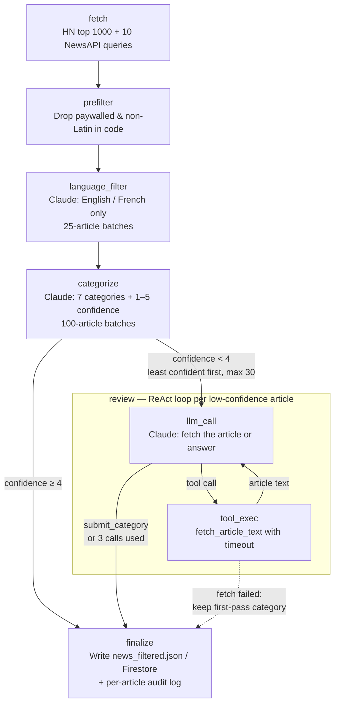

# Architecture

Stage-by-stage detail of the pipeline, how the agents are coordinated, and the subscription service. For the short version see the [README](../README.md).

## Stage by stage

**Agent 1a — Fetch & score papers**
Picks the week's spotlight paper from a **trending shortlist**: the 35 most-upvoted Hugging Face Daily Papers of the last 14 days that are `cs.AI`/`cs.LG` and have not been spotlighted before (history kept in Firestore `spotlighted_papers`; deduplication happens before truncating to 35, so the pool refills from the next-ranked papers). Claude scores each paper through forced tool use on 8 dimensions (`prompts/scoring_rubric.txt`, max 33), including a `wow_factor` (would a non-specialist instantly get why it matters). Code adds a `community_traction` score (1–8, from the paper's Hugging Face upvote percentile within the shortlist), for a total out of 41; the total is recomputed in code rather than trusted from the model. The top paper advances and is recorded as spotlighted. If Hugging Face or the ArXiv lookup fails (or yields fewer than 10 papers) it falls back to a random sample of 35 from the last 7 days of ArXiv. PDF fetches route through a Squid proxy (set via `HTTPS_PROXY`) because GCP IPs are throttled by ArXiv. Up to 5 concurrent Claude calls, exponential backoff on 429s (10s / 20s / 40s).

**Agent 1b — Fetch & filter news**
Pulls the week's top 1000 Hacker News stories by points (Algolia search API, since the front-page ranking decays before Monday) and runs 10 NewsAPI queries (English global, French global, Canada/Montreal). Pre-filters paywalled domains and non-Latin titles in code, then uses Claude to language-filter (English/French only, 25-article batches) and categorize into 7 categories (100-article batches). Up to 5 concurrent Claude calls. Internally a LangGraph graph (see [Inside agent 1b](#inside-agent-1b-langgraph)): the categorizer also reports a 1–5 confidence, and low-confidence articles are re-checked by a small tool-calling review loop that can fetch the article text before deciding.

**Agent 2a — Summarize papers**
Downloads PDFs again (falls back to abstract + scoring notes if unavailable), calls Claude to write a short curiosity-hook summary (2–3 sentences) of the spotlight paper. Up to 5 concurrent calls. Like agent 2b, it saves the exact source text each summary was written from (Firestore `summary_sources`, expiring) so the online judge can check a summary against what the summarizer saw.

**Agent 2b — Summarize news**
Fetches full article text with `newspaper3k` (GitHub repos via the GitHub API, Twitter/X URLs skipped). Calls Claude for a 2-3 sentence summary per article. Up to 3 concurrent Claude calls, 20 concurrent fetch workers.

**Fan-in**
Both agent 2a and 2b atomically increment `agent2_completions` in the Firestore run document using a Firestore transaction. The one that pushes the counter to 2 publishes `content-summarized` to trigger agent 3.

**Agent 3 — Compose**
Runs two article-selection passes per category (all languages, English-only) to support subscriber preference variants. Calls Claude to pick the best articles per category: 3 by default, more only for major stories. Each article is labelled with its HN points and its rank among the section's HN stories (vote counts vary by topic, so there is no fixed threshold); articles without an HN score are not penalized, and are shown in a seeded-shuffle order so list position carries no signal. Writes a 2-3 sentence editor's note. Renders 4 HTML variants keyed by `{include_french}_{include_canada}`. The spotlight paper renders as a dark hero card directly under the editor's note, linking to its Hugging Face page, and a one-line share strip follows the first news section. Saves all variants to Firestore (shrinking the run document's large article pools first, to stay under Firestore's 1 MiB document cap) and copies `0_0` to `public/newsletter/latest.html` for the live preview.

**Agent 4 — Send**
Triggered separately by Cloud Scheduler at 7 AM Monday, a day after the pipeline drafted the newsletter (Sunday 12 PM; the issue is dated the send day). Loads the most recent run's newsletter variants from Firestore, queries active subscribers, picks each subscriber's variant by preference key, substitutes `{{UNSUBSCRIBE_URL}}` and `{{PREFERENCES_URL}}` placeholders with per-subscriber token links, and sends via SendGrid. Logs a structured JSON send summary to stdout for Cloud Logging, and also writes it to the run's Firestore document (`agent4_send_summary`, `agent4_completed_at`) so delivery success is queryable, not just visible in logs. With `CLICK_TRACKING=true` it also turns on SendGrid click tracking and tags each email with the run id (never a subscriber id); see [Click signal](monitoring.md#click-signal). Refuses to send (raises instead) if the newsletter it found is more than 24 hours old — a stalled pipeline upstream of agent 3 otherwise leaves the most recent *composed* run pointing at an older week's content, which agent 4 would ship silently with no error. The stalled-pipeline case it guards against is described under [Design decisions](design-decisions.md).

**Health check**
A standalone agent, `agent_healthcheck.py`, run as **two separate checks**, each triggered by its own Cloud Scheduler job rather than by Pub/Sub (so it has no `run_id` handed to it; it looks up the most recent `pipeline_runs` document itself). Each check covers one segment of the pipeline:

- **Draft check — Sunday 1:15 PM, after the noon draft.** Did the newsletter compose properly? It verifies every stage through agent 3 and the composed output itself: all four preference variants present and non-trivial, the per-subscriber `{{UNSUBSCRIBE_URL}}` / `{{PREFERENCES_URL}}` placeholders intact, and the subject dated for the Monday send day. It runs a day ahead of the send so a failure can be fixed and re-run before subscribers are affected.
- **Send check — Monday 7:10 AM, after agent 4's 7:00 AM send.** Did the newsletter send? It verifies every stage plus delivery (`agent4_send_summary`: nothing sent, or partial failures) and reader clicks.

Both flag a stale run (no pipeline run started recently enough: more than 4 hours ago for the draft check, more than 30 for the send check, since the Sunday run is already about 19 hours old by Monday 7:10 AM), any recorded agent failure, or a missing stage, and each emails a report every run — a weekly heartbeat that says "all clear" or lists what's wrong, rather than only emailing on failure. Each report also carries informational sections for [drift](monitoring.md#drift-monitoring), [token usage and cost](monitoring.md#token-and-cost-monitoring), the [summary judge](monitoring.md#online-summary-judge) and [reader clicks](monitoring.md#click-signal), each isolated so a failure in one cannot suppress the heartbeat. Never touches the subscribers collection. See `CLAUDE.md` for the full failure-recording and detection mechanics.

## Two-layer orchestration

Coordination happens at two levels on purpose:

- **Between agents:** Pub/Sub events plus the Firestore `agent2_completions` counter. Each agent is its own Cloud Run service, so the join (agent 2a + 2b → agent 3) has to work across separate instances, and each stage keeps its own retries, timeouts and scaling.
- **Inside an agent:** LangGraph, where a stage has real internal control flow. Today that is agent 1b only. Local mode and cloud mode run the same graph code — `orchestrator.py` just calls each agent's `run()`.

Why LangGraph is *not* used across agents: [docs/decisions/0001-langgraph-inside-agents.md](decisions/0001-langgraph-inside-agents.md).

## Inside agent 1b (LangGraph)

- `categorize` returns a 1–5 `confidence` per article. The conditional edge after it sends articles below `REVIEW_CONFIDENCE_THRESHOLD` (least confident first, at most `REVIEW_MAX_ARTICLES` per run) to `review`, in parallel; everything else goes straight to `finalize`.
- `review` is a ReAct loop of two nodes: `llm_call` (Claude with `fetch_article_text` and `submit_category` tools) and `tool_exec` (fetches the article, with a timeout), looping while the model asks for the fetch tool, at most `REVIEW_MAX_ITERATIONS` LLM calls per article.
- A failed fetch, LLM error or exhausted loop never fails the run: the article keeps its first-pass category and is logged as `review_failed`.
- `finalize` writes exactly the original `data/news_filtered.json` / Firestore shape. A per-article audit (first-pass category, confidence, routed?, final category, tool calls, tokens) goes to `data/agent1b_review_log.json` and, in cloud mode, to Firestore `agent1b_audits/{run_id}` (plus a small `agent1b_review_summary` on the run doc).

| Variable | Default | Purpose |
|---|---|---|
| `AGENT1B_MODE` | `graph` | `single_pass` runs the original linear implementation (rollback switch, and the baseline for comparisons) |
| `REVIEW_CONFIDENCE_THRESHOLD` | `4` | Review articles with confidence below this (or missing) |
| `REVIEW_MAX_ARTICLES` | `30` | Per-run cap on reviewed articles (`0` disables review) |
| `REVIEW_MAX_ITERATIONS` | `3` | Max LLM calls per reviewed article |
| `REVIEW_FETCH_TIMEOUT` | `10` | Seconds per article fetch |
| `LANGSMITH_TRACING` | unset | Opt-in LangSmith tracing (needs an API key; otherwise a complete no-op). Token counts/cost per node. |

## Subscription system

A separate FastAPI service handles sign-ups and preferences. Two auth paths coexist:

**Token-based (email links):** The original "inbox is the authentication" model. Website-initiated actions trigger an email round-trip; token-carrying links clicked inside an email prove inbox ownership. Tokens are `secrets.token_urlsafe(32)`, 48h TTL for confirmation, 1-year TTL for action links. Still used for newsletter footer links (unsubscribe, preferences) for all subscribers.

**Account-based (Firebase Auth):** Users sign up or sign in via `login.html` using Google OAuth (email+password sign-up was removed; people without a Google account subscribe with just their email on the homepage and manage preferences through the emailed link). The frontend gets a Firebase ID token and sends it as `Authorization: Bearer <token>`. The backend (`agents/auth_middleware.py`) verifies it with `firebase-admin`. No confirmation email needed — Firebase handles email verification. Account-based subscribers can manage preferences and unsubscribe directly without waiting for an email link.

Subscriber document fields: `email`, `token`, `token_expires_at`, `active`, `subscribed_at`, `confirmed_at`, `prefs: {include_french, include_canada}`, `send_latest`, `latest_sent`, `uid` (Firebase UID, null for legacy token-only subscribers). Unsubscribe sets `active: false` (soft delete, never hard-deleted).
